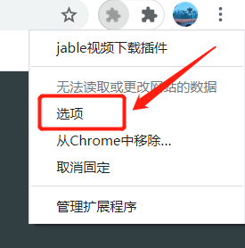
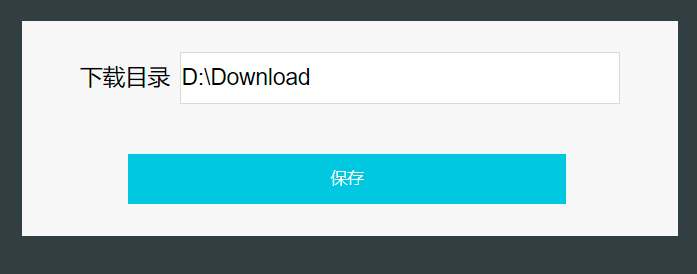
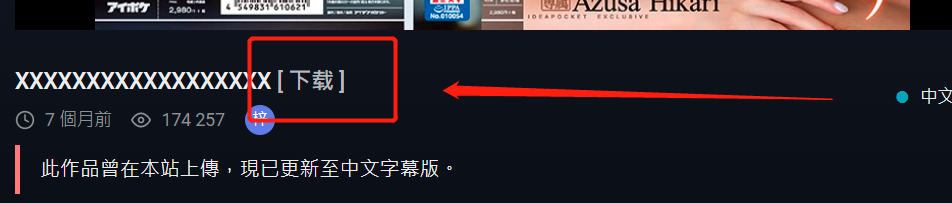

# 说明
这是一个方便下载jable的小工具

`jable-chrome-extensions`是chrome 插件

借用了 [N_m3u8DL-CLI](https://github.com/nilaoda/N_m3u8DL-CLI)实现下载`m3u8`，合并成 `mp4`功能

`N_m3u8DL-CLI`已经自带`m3u8dl`协议，注册就可使用

#### 实现流程
`注册一个协议` --> `chrome插件生成一个下载链接` --> `调用N_m3u8DL-CLI开始下载`

# 安装 

`chrome` 地址栏输入：chrome://extensions/

把`jable-chrome-extensions`整个文件拖进去就完成安装

右击 `init.bat`,以管理员身份运行，会向`注册表`添加一个协议注册，（杀毒软件可能会阻止，允许就行）

# 使用

chrome浏览器中，点击扩展图标 -> 选项，填写默认下载目录，点保存

**如果未设置下载目录，默认下载到 `%USERPROFILE%\Downloads\m3u8dl`，也就是当前用户下载目录** 

**如果下载失败，请设置一个不是C盘的目录，例如：D:\Downloads**

chrome 打开 https://jable.tv/videos/xx/ 播放页面

点击标题后面 `[下载]`,调用下载程序，

